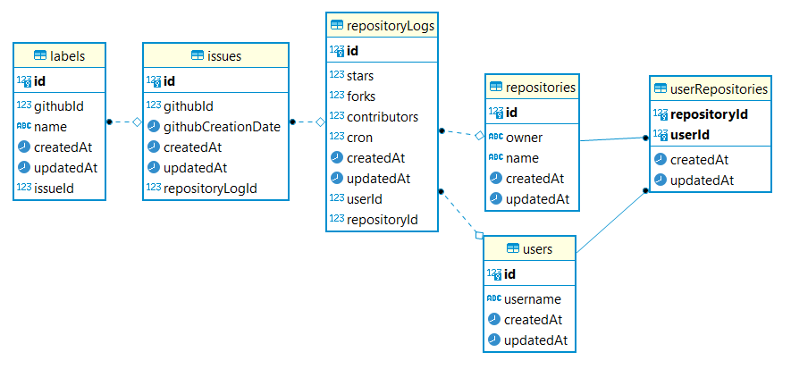

# LibQuality 

This project is designed to run the backend of famous open source projects

## Architecture:

In this service we will expose some APIs for the frontend
First this APIs will get to the Node controler wich is a Docker container running a node aplication.
This APIs will be accessible through the same network using basic authentication,
this way we can indentify users calling these services

This Node controler will call some github APIs in order to colect data and store them on a MySQL 
database, which is also alocated inside a Docker container.

## Node Controler
The Node controler will be structured in folders to keep code clean and organized.
Routes:
    Code in the Routes folder will be responsible to configure, receive data and respond the API.
    this folder will connect to the service folder to collect information not related to 
    the API comunication
Business:
    This folder will contain the business rules of the aplication, will connect to the Model and
    Requests to gather and send data.
Model:
    It's where the database interface happens, it is called by the business modules to collect and save
    data on MySQL database
Requests:
    this modules will receive some parameters from the business modules and use them to call the Github 
    API to collect data.

## Database

To collet all the needed data the database is structured with theese for tables
